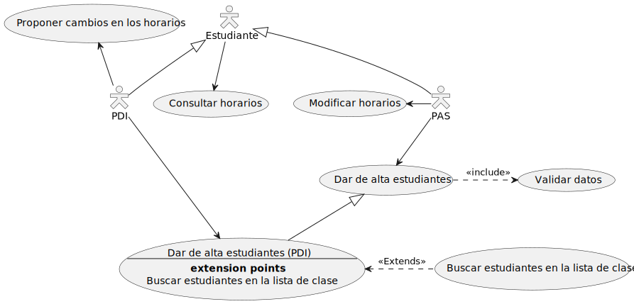

# INRE-UAL-BLANCO-2022

## **Integrantes**
---
1. **Daniel Perez Escarcena**  - dpe422@inlumine.ual.es
2. **Ioan Stefan Toderic** - it557@inlumine.ual.es
3. **Luca Daniel Gavriloaie** - lg330@inlumine.ual.es
4. **Guillermo Morales Caparros** - gmc348@inlumine.ual.es
5. **David Hernandez Carmona** - davidhdezcarmona@gmail.com

### ***Diagramas de Casos de Uso con plantUML***

---

#### **Supuesto 1: Horarios**

#### **Supuesto 2: Sistema de compras**

#### **Supuesto 3: Compañía hotelera**

#### **Supuesto 4: Fotografía Online**

#### **Supuesto 5: Gestión de Incidencias**

