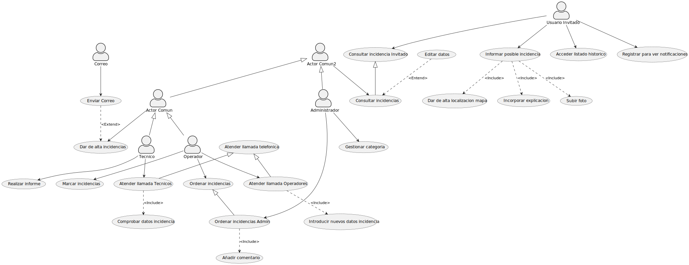

## ***Actividades***

---

### **Supuesto 1: Horarios➡️**
En una universidad, el personal del PDI, el personal del PAS y los estudiantes pueden consultar horarios. Por su parte, el personal del PAS puede modificar horarios y dar de alta estudiantes. El personal de PDI puede proponer cambios en los horarios y dar de alta estudiantes. La funcionalidad de dar de alta estudiantes del PAS realiza una verificación de los datos del estudiante. Sin embargo, la funcionalidad de dar de alta estudiantes del PDI, además de verificar los datos también permite de forma excepcional realizar la búsqueda en las listas de clase de sus asignaturas.

 

>#### **Definición de requisitos de información**
| |  |
| ---| :---: |
|  **ID** | IR-01 |
| **Nombre** | Horario |
| **Versión** | Versión 1 (21/10/2022) |
| **Autores** | Daniel Pérez Escarcena |
| **Fuentes** |  |
| **Referencias** | - Consultar horario   - Modificar horario   - Proponer cambios en los horarios|
| **Descripción** | El sistema deberá almacenar información correspondiente a los horarios de los estudiantes |
| **Datos específicos** | - Identificador del horario   - Nombre del horario   - Fecha de incorporación   - Fecha de validez  |
| **Importancia** | Muy importante |
| **Estado** | Aceptado |
| **Comentarios** | Ninguno |
||

| |  |
| ---| :---: |
|  **ID** | IR-02 |
| **Nombre** | Estudiante |
| **Versión** | Versión 1 (21/10/2022) |
| **Autores** | Daniel Pérez Escarcena |
| **Fuentes** |  |
| **Referencias** | - Buscar estudiantes en la lista de clase   - Dar de alta estudiantes   - Validar estudiantes|
| **Descripción** | El sistema deberá almacenar información de los estudiantes |
| **Datos específicos** | - Identificador del estudiante   - Nombre del estudiante   - Fecha de incorporación   - Fecha de nacimiento   -DNI |
| **Importancia** | Muy importante |
| **Estado** | Aceptado |
| **Comentarios** | Ninguno |
||

| |  |
| ---| :---: |
|  **ID** | IR-03 |
| **Nombre** | Lista de clase |
| **Versión** | Versión 1 (21/10/2022) |
| **Autores** | Daniel Pérez Escarcena |
| **Fuentes** |  |
| **Referencias** | - Buscar estudiante en la lista de clase |
| **Descripción** | El sistema deberá almacenar información correspondiente a los listados de clase de los estudiantes |
| **Datos específicos** | - Identificador del listado   - Nombre del listado   - Fecha de incorporación   - Numero de estudiantes  |
| **Importancia** | Muy importante |
| **Estado** | Aceptado |
| **Comentarios** | Ninguno |
||

 

>#### **Definición de casos de uso**

|| |
|-|:-:|
|**ID:**|UC-01|
|**Nombre:**|Modificar Horario|
|**Fecha:**|30/09/2022|
|**Autor:**|Daniel Perez|
|**Descripcion:**|Permite al actor PAS modificar el horario|
|**Actor:**|PAS|
|**Precondiciones:**|Pertenecer al PAS de esta institucion|
|**Flujo normal:**|1.Accedo a la web de la universidad 2.Entro como PAS 3.Accedo al horario 4.Modifico el horario|
|**Flujo aternativo:**|Ninguno|
|**Postcondiciones:**|Ninguna|
|**Referencias:**|Ninguna|
||

|| |
|-|:-:|
|**ID:**|UC-02|
|**Nombre:**|Dar de alta estudiantes|
|**Fecha:**|30/09/2022|
|**Autor:**|Daniel Perez|
|**Descripcion:**|Permite al actor PAS   dar de alta a los estudiantes|
|**Actor:**|PAS|
|**Precondiciones:**|Pertenecer al PAS de esta institucion|
|**Flujo normal:**|1.Accedo a la web de la universidad 2.Entro como PAS  3.Accedo al listado de estudiantes 4.Doy de alta al estudiante seleccionado|
|**Flujo aternativo:**|No existe el estudiante|
|**Postcondiciones:**|El estudiante ya no esta registrado|
|**Referencias:**|Validar datos Dar de alta estudiantes(PDI)|
||

|| |
|-|:-:|
|**ID:**|UC-03|
|**Nombre:**|Proponer cambios en los horarios|
|**Fecha:**|30/09/2022|
|**Autor:**|Daniel Perez|
|**Descripcion:**|Permite al actor PDI proponer cambios en los horarios|
|**Actor:**|PDI|
|**Precondiciones:**|Pertenecer al PDI de esta institucion|
|**Flujo normal:**|1. Accede a la web de la universidad   2.Entrar como PDI 3.Acceder a informacion del horario 4.Sugerir un cambio en el horario a la espera de ser aprobado|
|**Flujo aternativo:**|Ninguno|
|**Postcondiciones:**|Ninguna|
|**Referencias:**|Ninguna|
||

|| |
|-|:-:|
|**ID:**|UC-04|
|**Nombre:**|Validar datos|
|**Fecha:**|30/09/2022|
|**Autor:**|Daniel Perez|
|**Descripcion:**|Permite al actor PAS modificar el horario|
|**Actor:**|PAS|
|**Precondiciones:**|Pertenecer al PAS de esta institucion|
|**Flujo normal:**|1. Accede a la web de la universidad   2.Entrar como PAS 3.Acceder a los datos de los estudiantes 4.Validar los datos|
|**Flujo aternativo:**|Ninguno|
|**Postcondiciones:**|Ninguna|
|**Referencias:**|Dar de alta estudiantes|
||

|| |
|-|:-:|
|**ID:**|UC-05|
|**Nombre:**|Dar de alta estudiantes (PDI)|
|**Fecha:**|30/09/2022|
|**Autor:**|Daniel Perez|
|**Descripcion:**|Permite al actor PDI   dar de alta a los estudiantes|
|**Actor:**|PDI|
|**Precondiciones:**|Pertenecer al PDI de esta institucion|
|**Flujo normal:**|1.Accedo a la web de la universidad 2.Entro como PAS  3.Accedo al listado de estudiantes 4.Doy de alta al estudiante seleccionado|
|**Flujo aternativo:**|No existe el estudiante|
|**Postcondiciones:**|El estudiante ya no esta registrado|
|**Referencias:**|Dar de alta estudiantes Buscar estudiantes en la lista de clase|
||

|| |
|-|:-:|
|**ID:**|UC-06|
|**Nombre:**|Buscar estudiantes en la lista de clase|
|**Fecha:**|30/09/2022|
|**Autor:**|Daniel Perez|
|**Descripcion:**|Permite al actor PDI   buscar estudiantes en la lista de clase|
|**Actor:**|PDI|
|**Precondiciones:**|Pertenecer al PDI de esta institucion|
|**Flujo normal:**|1.Accedo a la web de la universidad 2.Entro como PAS  3.Accedo al listado de estudiantes 4.Busco al estudiante seleccionado|
|**Flujo aternativo:**|No existe el estudiante|
|**Postcondiciones:**|El estudiante ya no esta registrado|
|**Referencias:**|Dar de alta estudiantes (PDI)|
||

|| |
|-|:-:|
|**ID:**|UC-07|
|**Nombre:**|Consultar Horario|
|**Fecha:**|30/09/2022|
|**Autor:**|Daniel Perez|
|**Descripcion:**|Permite al actor PAS modificar el horario|
|**Actor:**|Estudiante, PDI, PAS|
|**Precondiciones:**|Ser un estudiante de esta institucion|
|**Flujo normal:**|1.Accedo a la web de la universidad 2.Entro como PAS 3.Accedo al horario 4.Consultar el horario|
|**Flujo aternativo:**|Ninguno|
|**Postcondiciones:**|Ninguna|
|**Referencias:**|Ninguna|
||

### **Supuesto 2: Sistema de compras➡️**
En un sistema de compra, existen cuatro tipos de usuarios: comprador, vendedor, proveedor y administrador. Los compradores pueden agregar productos, consultar precios, finalizar la compra y consultar ofertas. Agregar productos implica marcar esos productos como bloqueados. Los vendedores también pueden consultar ofertas y consultar precios. Los proveedores pueden consultar precios, avisar de nuevos productos y consultar ofertas. Avisar de nuevos productos, de forma excepcional, realiza la incorporación de una oferta. Los proveedores también tienen una funcionalidad para avisar del fin de una oferta. Cuando se avisa del fin de una oferta, se ejecuta la funcionalidad de eliminar la oferta. Ambas funcionalidades de avisar del proveedor tienen en común que se encarga de enviar una notificación. Los administradores pueden consultar precios, consultar ofertas y eliminar productos. La funcionalidad de consultar precios incluye una funcionalidad de buscar productos que es similar a la funcionalidad de consultar productos de los compradores. Sin embargo, la funcionalidad de consultar productos añade una funcionalidad para verificar la disponibilidad. Para realizar una venta, un comprador y un vendedor participan de forma conjunta. En dicha operación, se lleva a cabo el acuerdo de un precio; excepcionalmente, durante la realización de la venta, se consultará el histórico de ventas.

 

>#### **Definición de requisitos de información**
| |  |
| ---| :---: |
|  **ID** | IR-01 |
| **Nombre** | Producto |
| **Versión** | Versión 1 (21/10/2022) |
| **Autores** | Luca Daniel Gavriloaie |
| **Fuentes** |  |
| **Referencias** | - Consultar producto   - Buscar producto   - Agragar productos   - Eliminar producto   - Verificar disponibilidad   - Bloquear productos   - Consultar precio|
| **Descripción** | El sistema deberá almacenar información correspondiente a los productos del sistema de compras. En concreto: |
| **Datos específicos** | - Identificador del producto   - Nombre del producto   - Fecha de incorporación   - Stock disponible   - Precio   - En oferta (si o no)   - Fabricante   - Modelo |
| **Importancia** | Muy importante |
| **Estado** | Aceptado |
| **Comentarios** | Ninguno |

| |  |
| ---| :---: |
|  **ID** | IR-02 |
| **Nombre** | Ofertas |
| **Versión** | Versión 1 (21/10/2022) |
| **Autores** | Luca Daniel Gavriloaie |
| **Fuentes** |  |
| **Referencias** | - Incorporar oferta   - Avisar de fin de oferta   - Consultar oferta   - Eliminar oferta |
| **Descripción** | El sistema deberá almacenar información correspondiente a las ofertas del sistema de compras. En concreto: |
| **Datos específicos** | - Nombre de la oferta   - Fecha inicio   - Fecha fin   - Descuento aplicable   - Usuarios afectados |
| **Importancia** | Muy importante |
| **Estado** | Aceptado |
| **Comentarios** | Ninguno |

| |  |
| ---| :---: |
|  **ID** | IR-03 |
| **Nombre** | Ventas |
| **Versión** | Versión 1 (21/10/2022) |
| **Autores** | Luca Daniel Gavriloaie |
| **Fuentes** |  |
| **Referencias** | - Realizar venta   - Acordar precio |
| **Descripción** | El sistema deberá almacenar información correspondiente a las ventas realizadas en el sistema de compras. En concreto: |
| **Datos específicos** | - Fecha de la venta   - Comprador   - Vendedor   - Producto vendido   - Precio de venta |
| **Importancia** | Muy importante |
| **Estado** | Aceptado |
| **Comentarios** | Ninguno |

| |  |
| ---| :---: |
|  **ID** | IR-03 |
| **Nombre** | Avisos |
| **Versión** | Versión 1 (21/10/2022) |
| **Autores** | Luca Daniel Gavriloaie |
| **Fuentes** |  |
| **Referencias** | - Avisar fin de oferta   - Avisar de nuevo producto   - Avisar (Proveedor)   - Enviar notificación |
| **Descripción** | El sistema deberá almacenar información correspondiente a los avisos realizados en el sistema de compras. En concreto: |
| **Datos específicos** | - Fecha del aviso   - Emisor del aviso   - Motivo de aviso   - Destinatarios   |
| **Importancia** | Muy importante |
| **Estado** | Aceptado |
| **Comentarios** | Ninguno |

| |  |
| ---| :---: |
|  **ID** | IR-04 |
| **Nombre** | Notificaciones |
| **Versión** | Versión 1 (21/10/2022) |
| **Autores** | Luca Daniel Gavriloaie |
| **Fuentes** |  |
| **Referencias** | - Avisar fin de oferta   - Avisar (Proveedor)   - Enviar notificación |
| **Descripción** | El sistema deberá almacenar información correspondiente a las notificaciones enviadas en el sistema de compras. En concreto: |
| **Datos específicos** | - Fecha de la notificación   - Emisor de la notificación   - Aviso relacionado   - Destinatarios |
| **Importancia** | Muy importante |
| **Estado** | Aceptado |
| **Comentarios** | Ninguno |

 

>#### **Definición de casos de uso**
| |  |
| ---| :---: |
|  **ID**| UC-01 |
|  **Nombre** | ConsultarHistorico |
|  **Fecha** | 18/10/2022 |
|  **Autor** | Toderic Ioan Stefan |
|  **Descripcion** | El actor comprador y vendedor pueden acceder a un historico de ventas realizadas  |
|  **Actores** | Comprador, Vendedor |
|  **Precondiciones** | |
|  **Flujo Normal** | 1.El usuario actor o comprador accede al historial   2.Se carga la seccion de la base de datos de los hisotricos   3.Si existen ventas realizadas, devuelve un documento con todos los historicos hasta el momento |
|  **Flujo Alternativo** | 3A. Si no existen ventas realizadas hasta el momento, el sistema devuelve un mensaje de "Sin ventas" |
| **Postcondiciones** |  |
| **Referencias** | UC-05 |

| | |
| ----------- | :-----------: |
| **Identificador**: | UC-02 |
| **Nombre:** | IncorporarOferta |
| **Fecha:** | 30/09/2022 |
|  **Autor:** | Toderic Ioan Stefan |
|  **Descripcion:** | Boton opcional para incorporar una oferta   |
|  **Actores:** | Proveedor |
|  **Precondiciones:** | El usuario debe estar logueado como proveedor|
|  **Flujo normal:** | 1. El actor busca el producto en el formulario   2. Si se le incorpora la oferta, el producto se vera modificado el precio y se guarda con oferta|
|  **Flujo alternativo:** | 2.B Si no se incorpora la oferta el producto se guarda sin oferta |
|  **Postcondiciones:** | Modificar el precio del producto |
| **Referencias**|UC-08|

| |  |
| ---| :---: |
| **ID**| UC-03 |
| **Nombre**| ConsultarProducto|
| **Fecha**| 07/10/2022 |
| **Autor**| Ioan Stefan Toderic |
| **Descripcion**| Permite consultar el historico de ventas  |
| **Actores**| Comprador |
| **Precondiciones**| El usuario debe estar logueado como comprador |
| **Flujo Normal**|  1. El actor  pulsar el botón de Consultar productos para ver la lista de los productos   2. El actor visualiza la disponibilidad del producto   3. El actor busca el producto en el formulario de busqueda   4. El sistema busca el prodcto en la tabla de producto   5. Se comprueba la disponibildad del producto   6. Si el producto esta disponible se le muestra al actor|
| **Flujo Alternativo** | 4B. El producto no esta disponible, por lo que se le muestra al actor un mensaje de la no disponibilidad del producto |
|**Postcondiciones**| |
|**Referencias**| UC-15, UC-09 |

| | |
| ----------- | :-----------: |
|  **Identificador:**| UC-04 |
|  **Nombre:** | FinalizarCompra |
|  **Fecha:** | 30/09/2022 |
|  **Autor:** | Guillermo Morales Caparros |
|  **Descripcion:**| Termina la compra y da informacion sobre la compra realizada |
|  **Actores:**| Comprador |
|  **Precondiciones:** | Debe existir el producto |
|  **Flujo normal:** | 1- El comprador pulsa el boton de finalizar|
| | 2- El sistema cierra la vision de compra|
| | 3- Se muestra una pestaña nueva con los productos comprados y su precio correspondiente|
|  **Flujo alternativo:** | Ninguno |
|  **Postcondiciones:** |  |
|**Referencias**|  |

| |  |
| ---| :---: |
|  **ID**| UC-05|
|  **Nombre** | RealizarVenta |
|  **Fecha** | 13/10/2022 |
|  **Autor** | Luca Daniel Gavriloaie|
|  **Descripcion** | Permite realizar un venta |
|  **Actores** | Comprador, Vendedor |
|  **Precondiciones** | El comprador y el vendedor deben estar autenticados en el Sistema |
|  **Flujo Normal** | 1. El comprador elige el producto que desea comprar y lo anade al carrito de compra   2. El comprador comienza el proceso de tramitación del pedido   3. El vendedor busca el producto en el sistema   4. El vendedor verifica la disponibilidad del producto   5. El comprador y el vendedor se ponen de acuerdo en un precio   6. El comprador y el vendedor finalizan el trámite del pedido |
|  **Flujo Alternativo** | 4A. Si el producto no está disponible, el vendedor recibe una notificación de la circunstancia y se lo notifica al comprador. El proceso termina   4B. Los actores pueden consultar si lo desean el histórico de ventas del producto   5A. Si no se llega a un acuerdo con respecto al precio, el proceso se cancela. |
| **Postcondiciones** | El stock del producto vendido disminuye y se actualiza el histórico de ventas del mismo |
| **Referencias** | UC-01, UC-10 |

| | |
| ----------- | :-----------: |
| **Identificador**: | UC-06 |
| **Nombre:** | EliminarProducto |
| **Fecha:** | 30/09/2022 |
|  **Autor:** | Guillermo Morales Caparros |
|  **Descripcion:** | Permite eliminar un producto  |
|  **Actores:** | Administrador |
|  **Precondiciones:** | Debe existir el producto |
|  **Flujo normal:** | 1- El actor pulsa el boton para eliminar el producto|
| | 2- Aparece un mensaje de "producto eliminado"|
| | 3- El administrador selecciona "aceptar" y vuelve la pantalla inicial|
|  **Flujo alternativo:** | Ninguno |
|  **Postcondiciones:** | El producto debe desaparecer |
| **Referencias**||

| |  |
| ---| :---: |
|  **ID**| UC-07|
|  **Nombre** | AvisarFinDeOferta |
|  **Fecha** | 13/10/2022 |
|  **Autor** | Luca Daniel Gavriloaie|
|  **Descripcion** | El proveedor avisará a los usuarios del sistema sobre el fin de una oferta |
|  **Actores** | Proveedor |
|  **Precondiciones** | El proveedor debe estar autenticado en el sistema |
|  **Flujo Normal** | 1. El proveedor comprueba el estado de la oferta   2. El proveedor emitirá un aviso para todos los usuarios en forma de notificación   3. El proveedor eliminará la oferta |
|  **Flujo Alternativo** | 2A. El proveedor no podrá avisar del fin de la oferta si esta no va a finalizar |
| **Postcondiciones** | Ninguna |
| **Referencias** | UC-13, UC-14, UC-16 |

| |  |
| ---| :---: |
|  **ID**| UC-08|
|  **Nombre** | AvisarDeNuevoProducto |
|  **Fecha** | 14/10/2022 |
|  **Autor** | Luca Daniel Gavriloaie|
|  **Descripcion** | Permite avisar de la disponibilidad de un nuevo producto a los usuarios del sistema de compras |
|  **Actores** | Proveedor |
|  **Precondiciones** | El proveedor debe estar autenticado en el sistema |
|  **Flujo Normal** | 1. El proveedor busca el nuevo producto   2. El proveedor marca el nuevo producto como disponible   3. El proveedor emite un aviso para los usuarios del sistema de la disponibilidad del nuevo producto y de su precio |
|  **Flujo Alternativo** | 1A. Si el sistema no encuentra el producto, le notificará del error al actor   3A. Opcionalmente, el proveedor podrá crear una oferta para el nuevo producto |
| **Postcondiciones** | Ninguna |
| **Referencias** | UC-02 |

| |  |
| ---| :---: |
|  **ID**| UC-09 |
|  **Nombre** | VerificarDisponibilidad |
|  **Fecha** | 18/10/2022 |
|  **Autor** | Ioan Stefan Toderic |
|  **Descripcion** | Permite comprobar si el producto esta disponible o no  |
|  **Actores** | Comprador |
|  **Precondiciones** | Debe estar logueado como un comprador y consultar el producto |
|  **Flujo Normal** | 1. Busca en la base de datos el producto seleccionado y devuelve el producto en caso de que este disponible |
|  **Flujo Alternativo** | 1B. Busca en la base de datos el producto seleccionado y devuelve un mensaje en caso de que no este disponible |
| **Postcondiciones** |  |
| **Referencias** | UC-03 |

| |  |
| ---| :---: |
|  **ID**| UC-10 |
|  **Nombre** | AcordarPrecio |
|  **Fecha** | 14/10/2022 |
|  **Autor** | Toderic Ioan Stefan  |
|  **Descripcion** | El comprador y el vendedor se ponen de acuerdo en un precio común |
|  **Actores** | Comprador, Vendedor |
|  **Precondiciones** | Comprador y Vendedor deben estar autenticados en el sistema |
|  **Flujo Normal** | 1.El vendedor establece un precio y lo envia a la base de datos del sistema   2.El sistema establece el precio a dicho producto   3.El comprador recibe una notificacion con el precio ajustado por el vendedor y decide si comprarlo   4.Si acepta el precio, hace click sobre el boton Acordar   5.El Sistema abre una pestaña con un formulario para poder comprar dicho producto   6.El comprador acepta y envia el formulario   7.Se realiza una petición de precio acordado al sistema |
|  **Flujo Alternativo** | 4A. En caso que el comprador decida rechazar el precio propuesto por el vendedor, el sistema envia una petición al sistema "Precio denegado" |
| **Postcondiciones** |  |
| **Referencias** | UC-05 |

| | |
| ----------- | :-----------: |
| **Identificador:** | UC-11 |
| **Nombre:** | ConsultarOferta |
| **Fecha:** | 07/10/2022 |
| **Autor:** | Guillermo Morales Caparros |
| **Descripcion:** | Debe mostrar una serie de datos relacionados con la oferta |
| **Actores:** | Comun, Administrador, Vendedor, Proveedor |
| **Precondiciones:** | El usuario debe estar registrado como alguno de los actores permitidos|
| **Flujo normal:** | 1- El usuario selecciona la opcion para consultar oferta|
| | 2- Se abre una pestana que muestra los datos de la oferta|
| | 3- El usuario puede cerrar esa pestana volviendo al estado anterior|
| **Flujo alternativo:** | Ninguno |
| **Postcondiciones:** | Ninguna |
| **Referencias:** | Administrador Vendedor y Proveedor heredan de Comun |

| |  |
| ---| :---: |
|  **ID**| UC-12 |
|  **Nombre** | ConsultarPrecio |
|  **Fecha** | 18/10/2022 |
|  **Autor** | Toderic Ioan Stefan |
|  **Descripcion** | El sistema muestra el precio del producto seleccionado por el actor |
|  **Actores** | Administrador, Vendedor, Proveedor |
|  **Precondiciones** | Debe de ser estar logueado en el sistema como un administrador, un vendedor o un proveedor  |
|  **Flujo Normal** | 1. El actor envia una solicitud a la base de datos del producto   2. El sistema devuelve la peticion con el precio del producto seleccionado |
|  **Flujo Alternativo** |  |
| **Postcondiciones** |  |
| **Referencias** | UC-15 |

| |  |
| ---| :---: |
|  **ID**| UC-13|
|  **Nombre** | EliminarOferta |
|  **Fecha** | 14/10/2022 |
|  **Autor** | Luca Daniel Gavriloaie|
|  **Descripcion** | Permite eliminar la oferta del sistema de compras, actualizando el precio de los productos afectados por esta oferta |
|  **Actores** | Proveedor |
|  **Precondiciones** | El proveedor debe estar autenticado en el sistema |
|  **Flujo Normal** | 1. El proveedor solicita al sistema el listado de ofertas activas   2. El sistema muestra todas las ofertas   3. El proveedor selecciona la oferta que desea eliminar   4. El proveedor elimina la oferta |
|  **Flujo Alternativo** | 4A. La oferta no se podrá eliminar sin haber avisado previamente su finalización |
| **Postcondiciones** | Se actualiza el conjunto de ofertas activas y los productos afectados por la oferta eliminada vuelven a su precio anterior |
| **Referencias** | UC-07 |

|  |  |
| --- | :---: |
|  **ID**| UC-14 |
|  **Nombre** | AvisarProveedor |
|  **Fecha** | 18/10/2022 |
|  **Autor** | Luca Daniel Gavriloaie |
|  **Descripcion** | El proveedor podrá realizar avisos visibles en el sistema para determinados fines |
|  **Actores** | Proveedor |
|  **Precondiciones** | El proveedor debe estar autenticado en el sistema |
|  **Flujo Normal** | 1. El proveedor pulsa crear un aviso   2. El sistema lleva al proveedor a la interfaz de creación del aviso   3. El proveedor debe configurar el aviso (información, fecha y hora, duración...)   4. El proveedor crea el aviso   5. El proveedor envía una notificación con el aviso |
|  **Flujo Alternativo** | 3A. Si el proveedor pulsa enviar aviso sin completar la configuración necesaria, el sistema dará error y volverá a la vista de creación del aviso   3B. Si la fecha y/o la hora seleccionadas ya vencieron, el sistema dará error |
| **Postcondiciones** | Ninguna |
| **Referencias** | UC-07, UC-16 |

| |  |
| ---| :---: |
|  **ID**| UC-15 |
|  **Nombre** | BuscarProducto |
|  **Fecha** | 18/10/2022 |
|  **Autor** | Toderic Ioan Stefan  |
|  **Descripcion** | El comprador busca un producto en el sistema |
|  **Actores** | Comprador |
|  **Precondiciones** | El usuario debe estar logueado en el sistema como comprador |
|  **Flujo Normal** | 1.El actor introduce en la barra de busqueda del sistema un nombre del producto   2.El sistema devuelve un listado con los productos con el nombre similar disponibles en el sistema    |
|  **Flujo Alternativo** |  |
| **Postcondiciones** |  |
| **Referencias** | UC-03, UC-12 |

| |  |
| ---| :---: |
| **ID**| UC-16 |
| **Nombre** | EnviarNotificacion |
| **Fecha** | 18/10/2022 |
| **Autor** | Luca Daniel Gavriloaie |
| **Descripcion** | Permite enviar una notificación a los usuarios del sistema |
| **Actores** | Proveedor |
| **Precondiciones** | El proveedor debe estar autenticado |
| **Flujo Normal** | 1. El actor selecciona un aviso a notificar   2. El actor solicita al sistema enviar una notificación   3. El sistema consulta la información del aviso necesaria para generar la notificación   4. El sistema envía la notificación |
| **Flujo Alternativo** | 1A. Si no existe ningún aviso a notificar, el proceso termina |
| **Postcondiciones** | Ninguna |
| **Referencias** | UC-14 |

| |  |
| ---| :---: |
|  **ID**| UC-17 |
|  **Nombre** | Agregar productos |
|  **Fecha** | 18/10/2022 |
|  **Autor** | Luca Daniel Gavriloaie |
|  **Descripcion** | El comprador puede agregar productos a la cesta de compra |
|  **Actores** | Comprador |
|  **Precondiciones** | El comprador debe estar autenticado en el sistema |
|  **Flujo Normal** | 1. El comprador selecciona el producto deseado   2. El comprador solicita al sistema agregar el producto a la cesta de compra pulsando un botón   3. El sistema añade el producto a la cesta de compra del comprador   4. El comprador bloquea el producto |
|  **Flujo Alternativo** | 2A. Si no hay stock del producto, el sistema devuelve un error |
| **Postcondiciones** | La lista con los productos en la cesta de la compra se actualiza |
| **Referencias** | UC-18 |

| |  |
| ---| :---: |
|  **ID**| UC-18 |
|  **Nombre** | Bloquear productos |
|  **Fecha** | 21/10/2022 |
|  **Autor** | Luca Daniel Gavriloaie |
|  **Descripcion** | Permite bloquear una unidad de un producto reservandola para un comprador |
|  **Actores** | Comprador |
|  **Precondiciones** | El Comprador debe estar autenticado en el sistema |
|  **Flujo Normal** | 1. El Comprador solicita al sistema bloquear un producto   2. El Sistema registra dicho producto como bloqueado en la base de datos   3. El Sistema marca el producto como reservado |
|  **Flujo Alternativo** | 1A. Si el producto ya está bloqueado o reservado por otro comprador, se notificará de la circunstancia |
| **Postcondiciones** | El producto se marca en la base de datos como bloqueado |
| **Referencias** | UC-17 |

### **Supuesto 3: Compañía hotelera➡️**
En una compañía hotelera, el administrador y el comercial pueden consultar reservas. El comercial realiza ofertas y gestiona nuevas reservas. El administrador gestiona nuevas peticiones y también realiza ofertas. La realización de ofertas por parte del comercial conlleva un recálculo de precios. Además, dicha realización de ofertas conlleva opcionalmente el bloqueo temporal de una reserva. Los clientes, los administradores y los comerciales pueden consultar disponibilidades y visualizar ofertas. La consulta de disponibilidades y la consulta de reservas tienen la funcionalidad común de buscar elementos. Por su parte, la consulta de disponibilidades conlleva una funcionalidad que muestra un calendario.

>#### **Definición de requisitos de información**
| |  |
| ---| :---: |
|  **ID** | IR-01 |
| **Nombre** | Reservas |
| **Versión** | Versión 1 (21/10/2022) |
| **Autores** | Daniel Pérez Escarcena |
| **Fuentes** |  |
| **Referencias** | - Consultar reservas   - Gestionar nueva reserva    - Bloquear temporalmente una reserva|
| **Descripción** | El sistema deberá almacenar información correspondiente a las ofertas disponibles|
| **Datos específicos** | - Identificador de la oferta  - Nombre de la oferta   - Fecha de incorporación  - Precio de la oferta  |
| **Importancia** | Muy importante |
| **Estado** | Aceptado |
| **Comentarios** | Ninguno |
||

| |  |
| ---| :---: |
|  **ID** | IR-02 |
| **Nombre** | Ofertas |
| **Versión** | Versión 1 (21/10/2022) |
| **Autores** | Daniel Pérez Escarcena |
| **Fuentes** |  |
| **Referencias** | - Realizar oferta   - Visualizar oferta    - Bloquear temporalmente una reserva|
| **Descripción** | El sistema deberá almacenar información correspondiente a las ofertas disponibles|
| **Datos específicos** | - Identificador de la oferta  - Nombre de la oferta   - Fecha de incorporación  - Precio de la oferta  |
| **Importancia** | Muy importante |
| **Estado** | Aceptado |
| **Comentarios** | Ninguno |
||

| |  |
| ---| :---: |
|  **ID** | IR-03 |
| **Nombre** | Precio |
| **Versión** | Versión 1 (21/10/2022) |
| **Autores** | Daniel Pérez Escarcena |
| **Fuentes** |  |
| **Referencias** | - Recalcular precio |
| **Descripción** | El sistema deberá almacenar información correspondiente a los precios de las ofertas disponibles|
| **Datos específicos** | - Identificador de la oferta  - Nombre de la oferta   - Fecha de incorporación  - Precio de la oferta  |
| **Importancia** | Muy importante |
| **Estado** | Aceptado |
| **Comentarios** | Ninguno |
||

| |  |
| ---| :---: |
|  **ID** | IR-04 |
| **Nombre** | Peticiones |
| **Versión** | Versión 1 (21/10/2022) |
| **Autores** | Daniel Pérez Escarcena |
| **Fuentes** |  |
| **Referencias** | - Gestionar peticion|
| **Descripción** | El sistema deberá almacenar información correspondiente a las peticiones que hacen los clientes|
| **Datos específicos** | - Identificador de la peticion  - Nombre de la peticion   - Fecha de incorporacion|
| **Importancia** | Muy importante |
| **Estado** | Aceptado |
| **Comentarios** | Ninguno |
||

>#### **Definición de casos de uso**

|| |
|-|:-:|
|**ID:**|UC-01|
|**Nombre:**|Consultar|
|**Fecha:**|07/10/2022|
|**Autor:**|Daniel Perez|
|**Descripcion:**|Permite al cliente ver si hay plazas disponibles|
|**Actor:**|Cliente|
|**Precondiciones:**|Hereda de consultar|
|**Flujo normal:**|1 Querer hospedarse en el hotel  2. Consultar las disponibilidades|
|**Flujo aternativo:**|Ninguno|
|**Postcondiciones:**|Ninguna|
||

|| |
|-|:-:|
|**ID:**|UC-02|
|**Nombre:**|Visualizar ofertas|
|**Fecha:**|07/10/2022|
|**Autor:**|Daniel Perez|
|**Descripcion:**|Permite al cliente visualizar las ofertas del hotel|
|**Actor:**|Cliente|
|**Precondiciones:**|Ser un cliente del hotel|
|**Flujo normal:**|1 Hospedarse en el hotel 2-Ver las ofertas disponibles del hotel|
|**Flujo aternativo:**|Ninguno|
|**Postcondiciones:**|Ninguna|
||

|| |
|-|:-:|
|**ID:**|UC-03|
|**Nombre:**|Consultar disponibilidad|
|**Fecha:**|07/10/2022|
|**Autor:**|Daniel Perez|
|**Descripcion:**|Permite al cliente ver si hay plazas disponibles|
|**Actor:**|Cliente|
|**Precondiciones:**|Ninguna|
|**Flujo normal:**|1-Clickar la opcion para mostrar las disponibilidades  2-El sistema muestra las distintas opciones disponibles|
|**Flujo aternativo:**|1-No queda ninguna opcion disponible, por lo que se muestra un mensaje informativo|
|**Postcondiciones:**|Ninguna|
| **Referencias**|UC-01|
||

|| |
|-|:-:|
|**ID:**|UC-04|
|**Nombre:**|Buscar elemento|
|**Fecha:**|07/10/2022|
|**Autor:**|Daniel Perez|
|**Descripcion:**|Permite al cliente buscar un elemento en concreto para agilizar busqueda|
|**Actor:**|Cliente|
|**Precondiciones:**|Ninguna|
|**Flujo normal:**|1-El cliente escribe en el buscador el nombre del elemento 2-El sistema muestra todos los elementos que contengan la cadena introducida en el buscador|
|**Flujo aternativo:**|1-No hay ningun elemento, por lo que se muestra un mensaje informativo|
|**Postcondiciones:**|Ninguna|
| **Referencias**|UC-01|
||

|| |
|-|:-:|
|**ID:**|UC-05|
|**Nombre:**|Consultar reservas|
|**Fecha:**|07/10/2022|
|**Autor:**|Daniel Perez|
|**Descripcion:**|Permite al cliente ver si hay reservas realizadas a su nombre|
|**Actor:**|Cliente|
|**Precondiciones:**|El cliente debe estar registrado con su nombre de usuario o ID|
|**Flujo normal:**|1-Acceder al apartado de reservas 2-Seleccionar la opcion de mostrar reservas 3-El sistema muestra una tabla con las reservas realizadas|
|**Flujo aternativo:**|1-No hay ninguna reserva realizada, por lo que se muestra un mensaje informativo|
|**Postcondiciones:**|Ninguna|
| **Referencias**|UC-01|
||

|| |
|-|:-:|
|**ID:**|UC-06|
|**Nombre:**|Mostrar calendario|
|**Fecha:**|18/10/2022|
|**Autor:**|Guillermo Morales|
|**Descripcion:**|Permite al cliente ver el calendario para consultar la disponibilidad|
|**Actor:**|Cliente|
|**Precondiciones:**|Ninguna|
|**Flujo normal:**|1-Al acceder a la consulta de disponibilidades se muestra el calendario|
|**Flujo aternativo:**|1-Si no hay disponibilidades no se muestra el calendario|
|**Postcondiciones:**|Ninguna|
| **Referencias**|UC-01, UC-03|
||

|| |
|-|:-:|
|**ID:**|UC-07|
|**Nombre:**|Realizar ofertas|
|**Fecha:**|07/10/2022|
|**Autor:**|Daniel Perez|
|**Descripcion:**|Permite al administrador ver si hay ofertas disponibles|
|**Actor:**|Administrador|
|**Precondiciones:**|El administrador debe estar registrado con su nombre de usuario o ID|
|**Flujo normal:**|1-Acceder al apartado de ofertas 2-Seleccionar la opcion de mostrar ofertas 3-El sistema muestra una tabla con las ofertas disponibles|
|**Flujo aternativo:**|1-No hay ninguna oferta disponible, por lo que se muestra un mensaje informativo|
|**Postcondiciones:**|Ninguna|
| **Referencias**||
||

|| |
|-|:-:|
|**ID:**|UC-08|
|**Nombre:**|Gestionar peticion|
|**Fecha:**|07/10/2022|
|**Autor:**|Daniel Perez|
|**Descripcion:**|Permite al administrador ver las peticiones realizadas|
|**Actor:**|Administrador|
|**Precondiciones:**|El administrador debe estar registrado con su nombre de usuario o ID|
|**Flujo normal:**|1-Acceder al apartado de peticiones 2-Seleccionar la opcion de mostrar peticiones 3-El sistema muestra una tabla con las peticiones realizadas|
|**Flujo aternativo:**|1-No hay ninguna peticion realizada, por lo que se muestra un mensaje informativo|
|**Postcondiciones:**|Ninguna|
| **Referencias**||
||

|| |
|-|:-:|
|**ID:**|UC-09|
|**Nombre:**|Bloquear temporalmente una reserva|
|**Fecha:**|07/10/2022|
|**Autor:**|Daniel Perez|
|**Descripcion:**|Permite al administrador bloquear una reserva temporalmente|
|**Actor:**|Administrador|
|**Precondiciones:**|El administrador debe estar registrado con su nombre de usuario o ID|
|**Flujo normal:**|1-Acceder al apartado de reservas   2- Seleccionar la opcion de mostrar reservas   3-El sistema muestra una tabla con las reservas actuales   4-Selecciona la que quiere bloquear temporalmente|
|**Flujo aternativo:**|1-No hay ninguna reserva, por lo que se muestra un mensaje informativo|
|**Postcondiciones:**|Ninguna|
| **Referencias**|UC-11, UC-07|
||

|| |
|-|:-:|
|**ID:**|UC-10|
|**Nombre:**|Gestionar nueva reserva|
|**Fecha:**|07/10/2022|
|**Autor:**|Daniel Perez|
|**Descripcion:**|Permite al comercial gestionar una nueva reserva|
|**Actor:**|Comercial|
|**Precondiciones:**|El comercial debe estar registrado con su nombre de usuario o ID|
|**Flujo normal:**|1-Acceder al apartado de reservas   2- Seleccionar la opcion de mostrar reservas   3-El sistema muestra una tabla con las reservas actuales   4-Selecciona la opcion de añadir una nueva reserva|
|**Flujo aternativo:**||
|**Postcondiciones:**|Ninguna|
| **Referencias**||
||

|| |
|-|:-:|
|**ID:**|UC-11|
|**Nombre:**|Realizar oferta del comercial|
|**Fecha:**|07/10/2022|
|**Autor:**|Daniel Perez|
|**Descripcion:**|Permite al administrador realizar una oferta|
|**Actor:**|Administrador|
|**Precondiciones:**|El administrador debe estar registrado con su nombre de usuario o ID|
|**Flujo normal:**|1-Acceder al apartado de ofertas 2-Seleccionar la opcion de mostrar ofertas 3-El sistema muestra una tabla con las ofertas disponibles 4-Realizar una nueva oferta|
|**Flujo aternativo:**||
|**Postcondiciones:**|Ninguna|
| **Referencias**|UC-07, UC-09, UC-12|
||

|| |
|-|:-:|
|**ID:**|UC-12|
|**Nombre:**|Recalcular precio|
|**Fecha:**|07/10/2022|
|**Autor:**|Daniel Perez|
|**Descripcion:**|Permite al administrador modificar el precio que ofrece una oferta|
|**Actor:**|Administrador|
|**Precondiciones:**|El administrador debe estar registrado con su nombre de usuario o ID|
|**Flujo normal:**|1-Acceder al apartado de ofertas 2-Seleccionar la opcion de mostrar ofertas 3-El sistema muestra una tabla con las ofertas disponibles 4-Seleccionar una oferta concreta 5-Cambiar el precio de la oferta|
|**Flujo aternativo:**||
|**Postcondiciones:**|Ninguna|
| **Referencias**|UC-07, UC-09, UC-11|
||

### **Supuesto 4: Fotografía Online➡️**
En una aplicación de fotografía online, los clientes pueden visualizar las fotos, donde de forma excepcional se puede realizar una denuncia sobre la foto. Al denunciar una foto, se ha de introducir una explicación sobre la denuncia. Los clientes también pueden llevar a cabo consultas sobre las fotos, operación que es un caso particular de visualizar las fotos. Los controladores de fotos pueden indicar que una foto debe ser revisada. Esta funcionalidad es un caso general de la funcionalidad de denunciar foto. Además, los controladores también pueden editar la información de las fotos. En esta aplicación también participan usuarios de tipo vendedor. Los vendedores pueden escribir a los clientes para hacerles ofertas sobre los productos de la aplicación. De forma excepcional, al hacer una oferta pueden reducir el precio de un producto. Los vendedores también pueden buscar detalles en las fotos, operación que es un caso particular de visualizar fotos. Pero esa búsqueda conlleva la verificación de los datos introducidos. Por otro lado, los gestores de la aplicación pueden ver ofertas, bloquear ofertas, emitir facturas y editar facturas. La emisión de facturas requiere la participación de un software de facturación. El administrador de la tienda puede ver ofertas, emitir facturas, editar facturas, bloquear ofertas, crear usuarios y editar usuarios. Esta funcionalidad de ver ofertas también la pueden realizar los clientes. Editar usuarios tiene características en común con editar facturas. Crear usuarios conlleva el envío de un email en el que es necesario el uso de un gestor de correo.

### **Supuesto 5: Gestión de Incidencias➡️**
En un sistema de gestión de incidencias, los técnicos y los operadores pueden dar de alta incidencias, para lo cual, de forma excepcional se enviará un correo (en esta operación participa un sistema de gestión de correo). Los técnicos también atienden llamadas telefónicas y realizan informes sobre las incidencias. Por su parte, los operadores atienden llamadas telefónicas, marcan incidencias como duplicadas y ordenan incidencias. La forma de atender llamadas de los técnicos y los operadores no es exactamente igual, pero tiene similitudes. De forma específica, cuando los técnicos atienden llamadas, comprueban datos de la incidencia en el sistema. Cuando los operadores atienden llamadas, introducen nuevos datos de la incidencia. Los administradores del sistema gestionan categorías de incidencias, consultan incidencias y ordenan incidencias. La ordenación por parte de los administradores conlleva la adición de un comentario. Los técnicos y los operadores también pueden consultar incidencias. La consulta de incidencias por parte técnicos, operadores y administradores puede conllevar, de forma excepcional, la edición de los datos de la incidencia. Los usuarios invitados también pueden consultar incidencias, pero sin la posible edición de los datos. Además, los invitados informan sobre posibles incidencias, se pueden registrar para ver notificaciones y pueden acceder a un listado del histórico de notificaciones. El informe de posibles incidencias conlleva el dar de alta la localización en un mapa, la incorporación de una explicación completa en formato textual y la subida de una foto.

